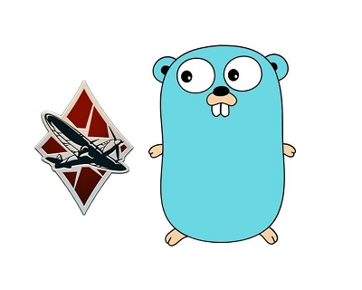

[](https://www.codefactor.io/repository/github/lucasvmx/wartelemetry)

# War Telemetry



A simple library to get WarThunder data provided by the localhost server

# Usage

## Example
```go
package main

import (
	"log"
	"time"

	"github.com/lucasvmx/WarTelemetry/logger"
	wartelemetry "github.com/lucasvmx/WarTelemetry/telemetry"
)

func main() {
	// Not needed if war thunder is running on localhost
	wartelemetry.Initialize("192.168.1.35")

    // Enable internal debug logging (disabled by default)
	logger.EnableDebug()

	for {

		t, err := wartelemetry.GetTelemetryData()
		if err != nil {
			log.Printf("failed to collect data: %v", err)
			time.Sleep(time.Second * 3)
			continue
		} else {
			log.Printf("Aircraft Name: %v", t.Indicators.AircraftName)
		}
	}
}

```

## Get Packages
```sh
go get -v
```

## Build program
```sh
go build
```

# Thanks
- [Elyakim Klettke](https://github.com/elyakimklettke)
