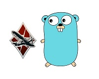

[](https://www.codefactor.io/repository/github/lucasvmx/wartelemetry)

# War Telemetry



A simple library to get WarThunder data provided by the localhost server

# Usage

## Example
```go
package main

import (
	"fmt"

	wartelemetry "github.com/lucasvmx/WarTelemetry/telemetry"
)

func main() {
	// Not needed if war thunder is running on localhost
	wartelemetry.Initialize("192.168.0.34")

	for {
		t, _ := wartelemetry.GetTelemetryData()
		objs := t.MapObjects

		for _, obj := range objs {
			fmt.Printf("type: %v, x: %v, y: %v\n", obj.Type, obj.X, obj.Y)
		}
	}
}
```

## Get Packages
```sh
go get -v
```

## Build program
```sh
go build
```

# Thanks
- [Elyakim Klettke](https://github.com/elyakimklettke)
